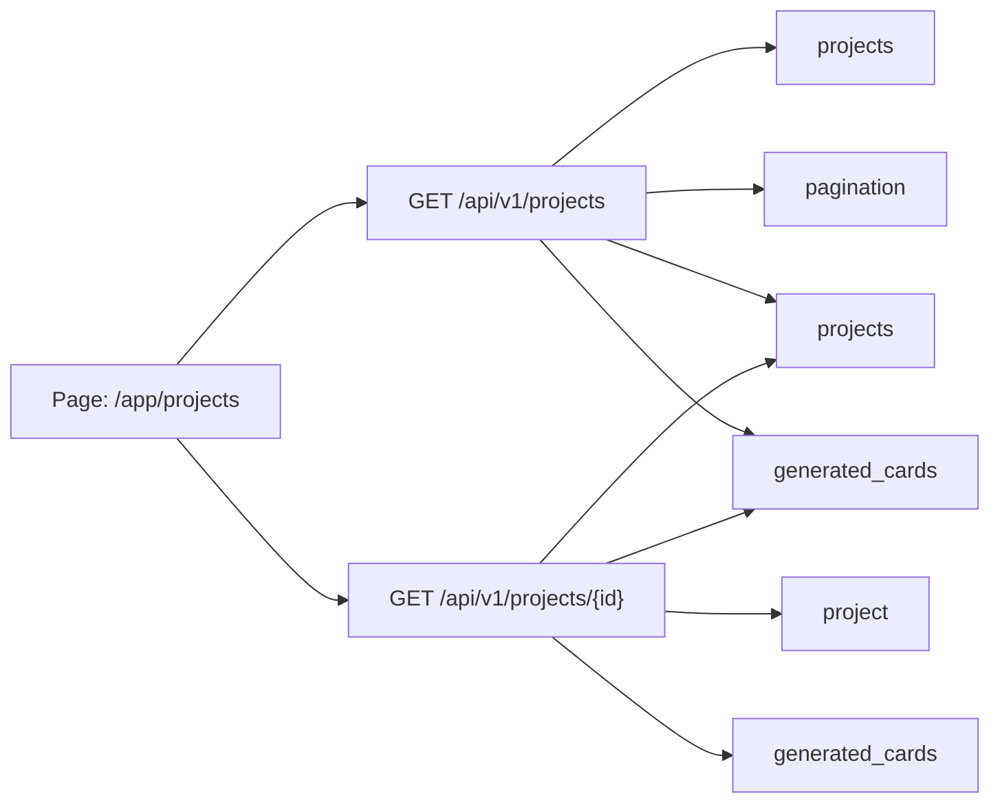

# Страница /app/projects: Page -> API -> DB tables

```mermaid
flowchart LR
    P["Page: /app/projects"] --> A1["GET /api/v1/projects"]
    P --> A2["GET /api/v1/projects/{id}"]

    A1 --> D1["projects"]
    A1 --> D2["pagination"]

    A2 --> D3["project"]
    A2 --> D4["generated_cards"]

    A1 --> T1["projects"]
    A1 --> T2["generated_cards"]

    A2 --> T1
    A2 --> T2
```
