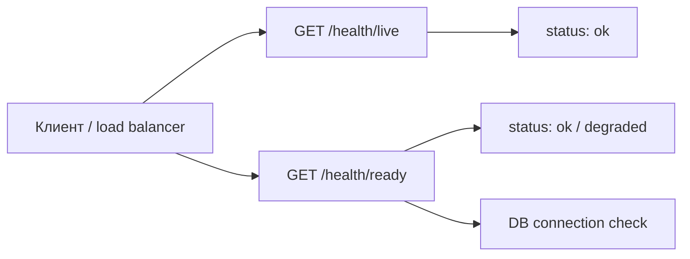

# Health-эндпоинты: Client -> API

```mermaid
flowchart LR
    C["Клиент / load balancer"] --> A1["GET /health/live"]
    C --> A2["GET /health/ready"]

    A1 --> D1["status: ok"]
    A2 --> D2["status: ok / degraded"]

    A2 --> T1["DB connection check"]
```
