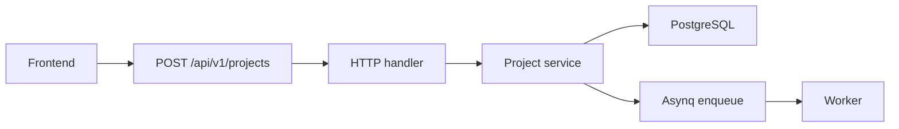

# Mermaid Example

Ниже маленький пример Mermaid-диаграммы для backend-потока.

```mermaid
flowchart LR
    A["Frontend"] --> B["POST /api/v1/projects"]
    B --> C["HTTP handler"]
    C --> D["Project service"]
    D --> E["PostgreSQL"]
    D --> F["Asynq enqueue"]
    F --> G["Worker"]
```
